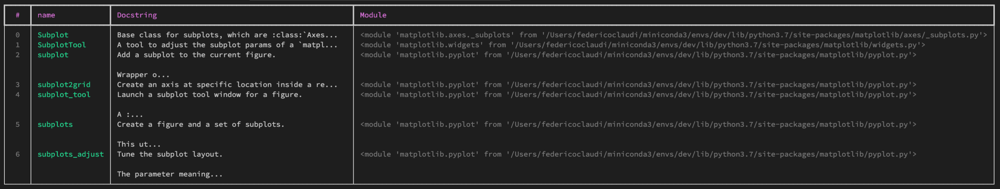
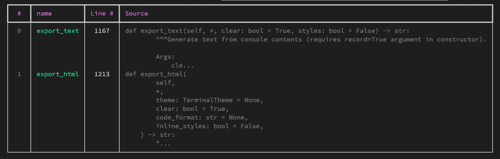

# pyinspect
If, like me, when coding often you *know* which function you need but can't quite remember 
its name, then I have **good news!**. `pyinspect` is here to help you out. 

`pyinspect` allows you to search for functions and class methods based on their name and 
prints out a handy table with all the functions that met your search criteria.


[](https://img.shields.io/github/issues-raw/FedeClaudi/pyinspect)
[](https://img.shields.io/github/license/FedeClaudi/pyinspect)


### Installing pyinspect
It's as simple as:
``` shell
pip install pyinspect
```


## Finding functions
The easiest way to grasp how `pyinspect` can help is with an example.
> Imagine that you just can't remember which `matplotlib.pyplot` method you need to create a figure with subplots... 
> 
this is how you use `pyinspect` to find it:


``` python
# import the module whose functions you're looking for
import matplotlib.pyplot as plt

# import pyinspect
import pyinspect

# Find the functions you're looking for
funcs = pyinspect.search(plt, name='subplot')
```

This results in:
</img>

**note**: search also looks for functions in sub-modules of the module found.
e.g.  `search(matplotlib...)` will look for methods across the entire `matplotlib` library!

\
`pyinspect.find` can also be used to find class attributes. For example,
say that you're looking for a method with `export` in the name in `rich.console.Console`:

``` python
# import the class you need to inspect
from rich.console import Console

# import pyinspect
import pyinspect

# find class methods
methods = pyinspect.search(Console, 'export')
```

Which gives:
</img>


**note**: search also looks for methods matching your query 
among the parents of the `class` you passed. Pass `include_parents=False`
when calling `search` to restrict the search to just the class you've passed.

**PRO TIP:** if you don't pass a search string (e.g. `pyinspect.find(Console)`), `pyinspect.find` will print **all** functions and methods.

\
## Inspecting functions
Okay, you've found the function you need, that's great. *But how does it work?*

What if, in addition to the exact name, you've forgotten which arguments it takes, or how it 
works exactly. Well, `pyinspect` can help you there as well!
You can use `pyinspect.print_function` to print the source code of any function or attribute:

``` python 

# import the class you're using
from rich.console import Console


# import pyinspect
import pyinspect

# Print a function's source code
pyinspect.print_function(Console.export_text)
```

which yields:
</img>


## Tracebacks
Finally, `pyinspect` builds upon `rich`'s awesome `traceback` functionality to 
print nicely formatted tracebacks **and** show the `local variables` when the exception came up.

E.g.:
``` python

# import pyinspect and install the traceback handler
import pyinspect
pyinspect.install_traceback()

# make some buggy code
import numpy as np

def sum(a, b):
    return a + b

a = np.ones(5)
b = np.zeros(4)

sum(a, b)
```

and this is the traceback:
</img>


## Aknowledgements
`pyinspect` is mostly a thin wrapper on top of the **awesome** [`rich`](https://github.com/willmcgugan/rich) library, so a huge thank you goes to @willmcgugan for the great job done with `rich`.
