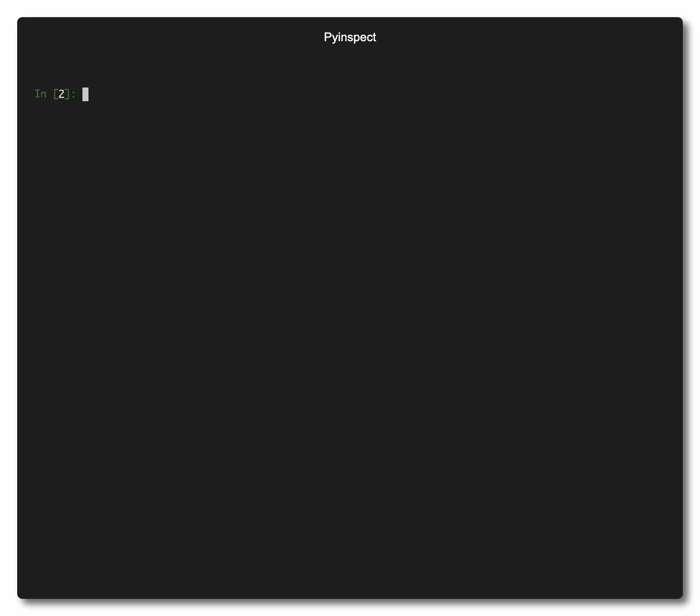
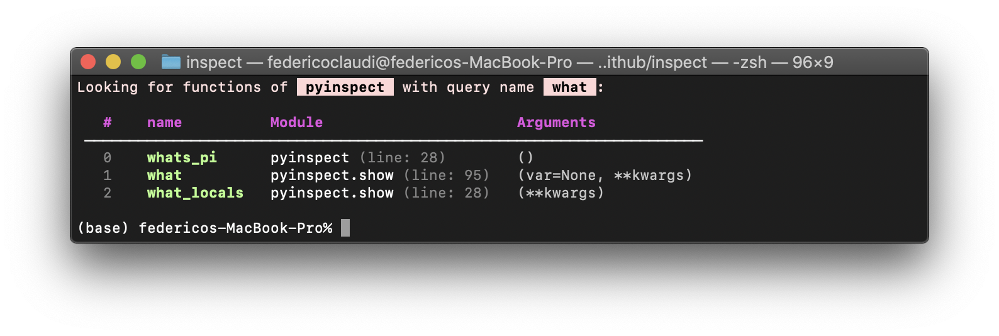
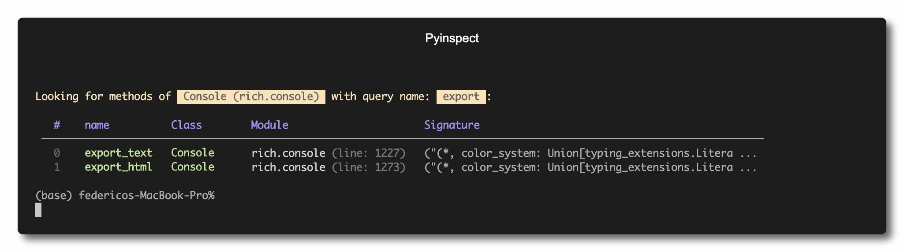
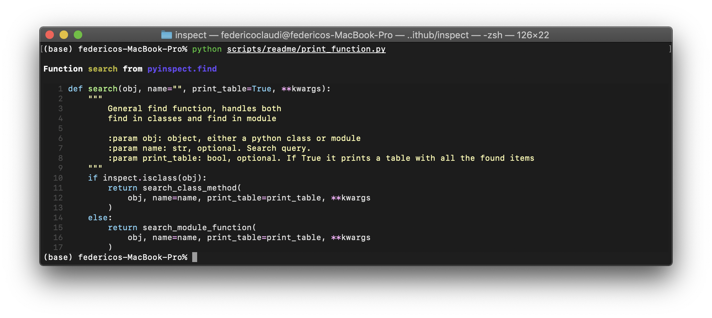
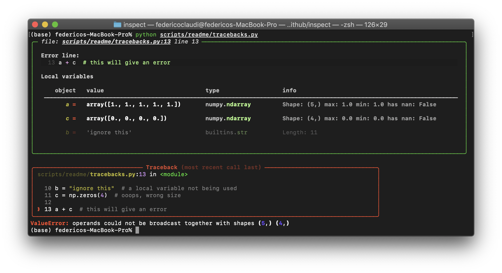

[](https://img.shields.io/github/issues-raw/FedeClaudi/pyinspect)
[](https://img.shields.io/github/license/FedeClaudi/pyinspect)
[](https://img.shields.io/github/languages/top/FedeClaudi/pyinspect)
[](https://img.shields.io/github/last-commit/FedeClaudi/pyinspect/master)
[](https://img.shields.io/github/stars/FedeClaudi/pyinspect?style=social)
[](https://github.com/psf/black)


[](https://twitter.com/Federico_claudi)


# pyinspect
If, like me, when coding often you *know* which function you need but can't quite remember 
its name, then I have **good news!**. `pyinspect` is here to help you out. 

`pyinspect` allows you to search for functions and class methods based on their name and 
prints out a handy table with all the functions that met your search criteria.
You can also use `pyinspect` to print a function's code directly in your terminal so that you can remind yourself what it does without having to open any file!

[](media/intro_cut.gif)


# Table of Contents
1. [Installing pyinspect](##Installing pyinspect)
2. [ExamplFinding functionse2](#Findingfunctions)
3. [Third Example](#third-example)
4. [Fourth Example](#fourth-examplehttpwwwfourthexamplecom)


## Installing pyinspect
It's as simple as:
``` shell
pip install pyinspect
```


## Finding functions
The easiest way to grasp how `pyinspect` can help is with an example.
> Imagine that you just can't remember which `matplotlib.pyplot` method you need to create a figure with subplots... 
> 
this is how you use `pyinspect` to find the function you need:


``` python
# import the module whose functions you're looking for
import matplotlib.pyplot as plt

# import pyinspect
import pyinspect

# Find the functions you're looking for
funcs = pyinspect.search(plt, name='subplot')
```

This results in a table with all the function's matching your search `name`:
</img>

**note**: search also looks for functions in sub-modules of the module found.
e.g.  `search(matplotlib...)` will look for methods across the entire `matplotlib` library!

\
`pyinspect.find` can also be used to find class attributes. For example,
say that you're looking for a method with `export` in the name in `rich.console.Console`:

``` python
# import the class you need to inspect
from rich.console import Console

# import pyinspect
import pyinspect

# find class methods
methods = pyinspect.search(Console, 'export')
```

Which gives:
</img>


>**note**: search also looks for methods matching your query 
among the parents of the `class` you passed. Use `include_parents=False`
when calling `search` to restrict the search to just the class you've passed.
Methods of the parent class are highlighted in a different color!

>**PRO TIP:** if you don't pass a search name to `pyinspect.search` (e.g. `pyinspect.find(Console)`), `pyinspect.search` will print **all** functions and methods.


## Inspecting functions
Okay, you've found the function you need, that's great. *But how does it work?*

What if, in addition to the exact name, you've forgotten which arguments it takes, or what it does exactly. Well, `pyinspect` can help you there as well!
You can use `pyinspect.print_function` to **print the source code of any function or attribute directly in your terminal**. This way you can inspect what the function does without having to open any file!

This is how to do it:
``` python 
# import pyinspect
import pyinspect as pi

# Look at how pyinspect.search works
pi.showme(pi.search)
```

which yields:
</img>


## Tracebacks
Finally, `pyinspect` builds upon `rich`'s awesome `traceback` functionality to 
print nicely formatted tracebacks **and** show the `local variables` when the exception came up.

E.g.:
``` python
# import pyinspect and install the traceback handler
import pi

pi.install_traceback()  # use hide_locals=True to hide locals panels

# make some buggy code
import numpy as np

a = np.ones(5)
b = "ignore this"  # a local variable not being used
c = np.zeros(4)  # ooops, wrong size

a + c  # this will give an error
```

and this is the traceback:
</img>

> **note**: although we defined three variables (`a`, `b`, `c`) only two where in the line causing the error (`a + c`). `pyinspect` then highlights `a` and `c` in the traceback as this is what you need to know to fix your bug. If you want `pyinspect` to **only** show the variables in the error line pass `relevant_only=True` to `pi.install_traceback()`

**pro tips**: 
* if you want to show **all** items in the `local` scope (e.g. also imported modules, not just variables) then you can use `all_locals=True` in `pi.install_traceback()`
* if you don't want the locals to be shown at all, then use `hide_locals=True`
* if you want more or less extensive tracebacks, you can use `keep_frames` to decide how many `frames` to shown in nested tracebacks (i.e when a function `a` calls a function `b` and the error comes up in `b`, do you want to see only the locals in `b` or in `a` *and* `b`?)

## Contributing
Contributions are welcome! Start a pull request if you have a change you'd like to submit or open an issue to report a bug or request a new feature to be added to `pyinspect`

## Aknowledgements
`pyinspect` is mostly a thin wrapper on top of the **awesome** [`rich`](https://github.com/willmcgugan/rich) library, so a huge thank you goes to @willmcgugan for the great job done with `rich`.
